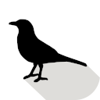
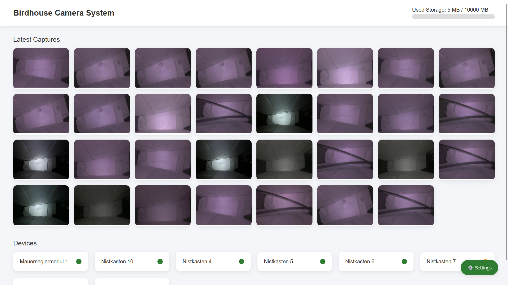
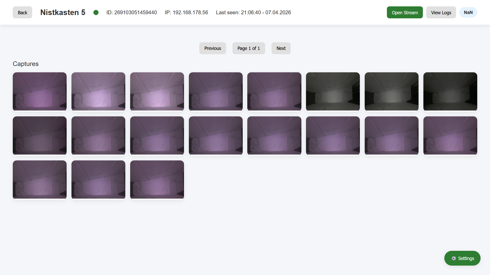
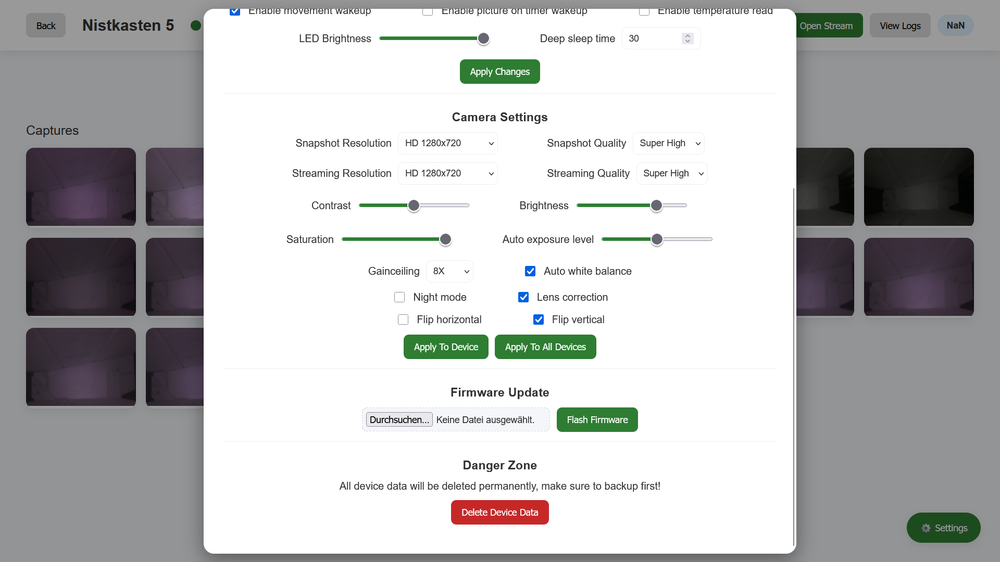
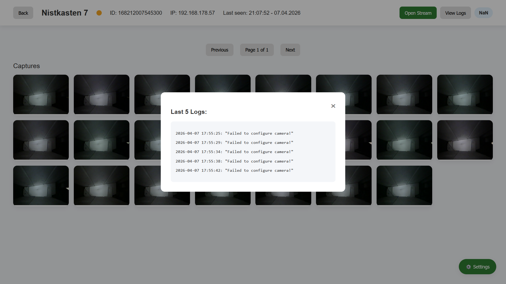
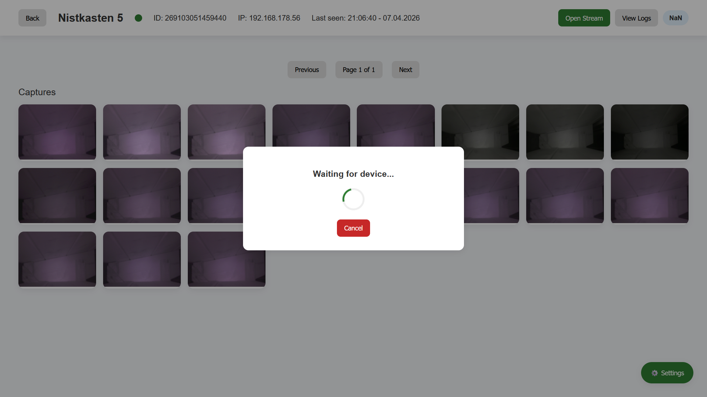

# Birdhouse Camera System - Server

**Overview:**  

This repository contains the Flask-based backend and web interface for the Birdhouse Camera System. It acts as the central hub that receives data from multiple ESP32 camera nodes, processes incoming information, and presents it to the user through a clean and intuitive web interface. The server is designed to run on a lightweight system such as a Raspberry Pi and is optimized for continuous operation in a local network environment. It handles image storage, device management, and system monitoring, while also providing tools to interact with and control the connected camera nodes. The system is built to support multiple devices simultaneously, making it easy to scale from a single birdhouse to a larger network of monitoring nodes. Since this server is designed for the local home network, no authentication is implemented and malicious requests are possible.  
All data is stored locally, ensuring full control and privacy. The system does not rely on cloud services, making it ideal for users who prefer self-hosted solutions.  
This project was sponsored by [NextPCB](https://www.nextpcb.com/). They offer great quality printed circuit board production at a low price. All the camera node PCBs were fabricated by them, more on that in the blog:  

[ESP32-CAM Repository](https://github.com/KonradWohlfahrt/BirdhouseCameraSystemCameraNode)  
[Instructables Guide](https://www.instructables.com/Flexible-Birdhouse-Camera-System-for-Multiple-Nest/)  

**Key Features:**  

- *Image Storage and Gallery View*  
Images are saved and displayed through the web interface. 
- *Flexible Device Management with Status*  
The system easily scales as new devices get added. The status of each device helps to find bugs during operation.
- *Data Download*  
Allowing for easy backup and system restore.
- *Device Configuration*  
The user can configure different camera settings to fit their needs.
- *Over-the-Air Firmware Updates*  
Pushing updates to the devices can be done via ethernet using the web interface.
- *Live Stream*  
Real-time view of the birdhouse can be requested by the user.

**Repository Contents:**  

- `/img` - Images for Readme
- `/static` - CSS, JS and other static files of the web page
- `/templates` - HTML files of the web page
- `app.py` - Main Flask application
- `gunicorn_config.py` - Configuration for the gunicorn production server
- `requirements.txt` - Python requirements


---

## Materials
- Raspberry Pi Zero 2 W + Micro SD card
- Raspberry Pi power supply
- Micro USB ethernet adapter
- Housing (optional)
- Network switch + LAN cables
- Camera nodes + 5V power supply


---

## Setup
Flash the Raspberry Pi with the latest non-desktop 64-bit OS using the [Raspberry Pi Imager](https://www.raspberrypi.com/software/). It is recommended to enable auto login, ssh and set a hostname using the `sudo raspi-config` menu on the Pi.  

### 1. Install updates

```bash
sudo apt update
sudo apt upgrade -y
sudo apt install python3 python3-venv python3-pip git -y
```

### 2. Clone the repository

```bash
git clone https://github.com/KonradWohlfahrt/BirdhouseCameraSystemServer.git birdhouse
cd birdhouse
```

### 3. Create virtual environment

```bash
python3 -m venv venv
source venv/bin/activate
pip install -r requirements.txt
```

### 4. Test the server

```bash
gunicorn -c gunicorn_config.py app:app
```

### 5. Create systemd service

```bash
sudo nano /etc/systemd/system/gunicorn.service
```

With the following content:  

```bash
[Unit]
Description=Birdhouse Flask Server
After=network.target

[Service]
User=pi
WorkingDirectory=/home/pi/birdhouse
Environment="PATH=/home/pi/birdhouse/venv/bin"
ExecStart=/home/pi/birdhouse/venv/bin/gunicorn -c gunicorn_config.py app:app

Restart=always
RestartSec=5

[Install]
WantedBy=multi-user.target
```

### 6. Enable service

```bash
sudo systemctl daemon-reload
sudo systemctl enable gunicorn
sudo systemctl start gunicorn
sudo journalctl --vacuum-time=7d

sudo systemctl status gunicorn
```

The server should now be hosted on `http://<pi ip>:8000` or `http://<hostname>:8000`. It automatically starts after boot.  


## API Endpoints
The server exposes several endpoints for communication:  

**Camera Node:**  
- `/devices/log` - POST
- `/devices/temperature` - POST
- `/devices/image` - POST
- `/devices/settings?device=` - GET

**Web page:**  
- `/api/devices` - GET
- `/api/device-information?device=` - GET
- `/api/log?device=&latest=` - GET
- `/api/temperature?device=&latest=` - GET
- `/api/device-status?device=` - GET
- `/api/stream?device=` - GET
- `/api/device-settings?device=` - GET, POST
- `/api/firmware?device=` - POST
- `/api/images?device=&page=`- GET
- `/api/image-pages?device=` - GET
- `/api/latest-images` - GET
- `/api/image?device=&name=` - GET, DELETE
- `/api/download-image?device=&name=` - GET
- `/api/storage-usage` - GET
- `/api/version` - GET
- `/api/download?device=&type=` - GET
- `/api/settings` - GET, POST
- `/api/delete-data?device=` - DELETE


---

## Gallery




